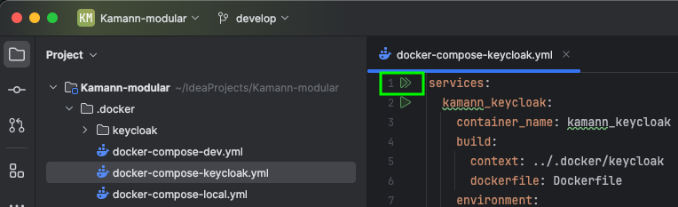
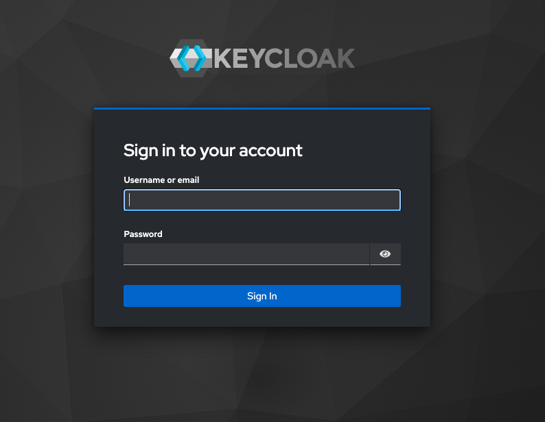
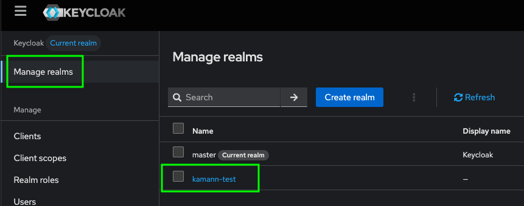
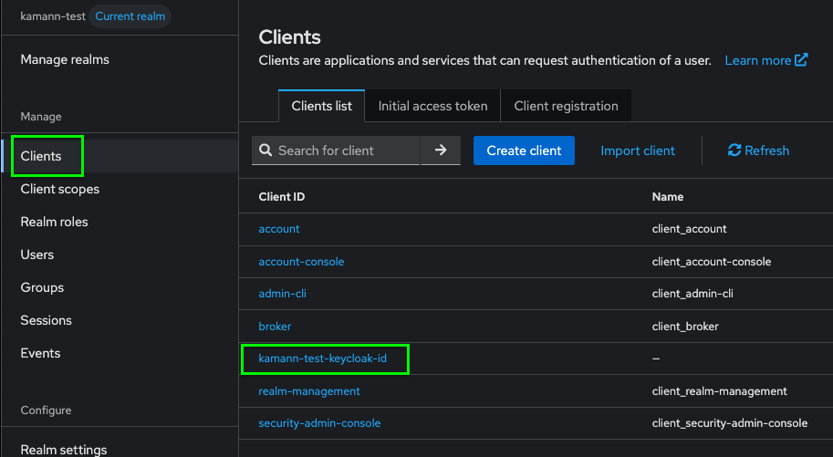
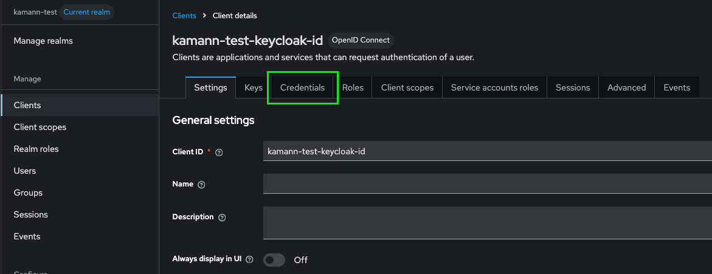
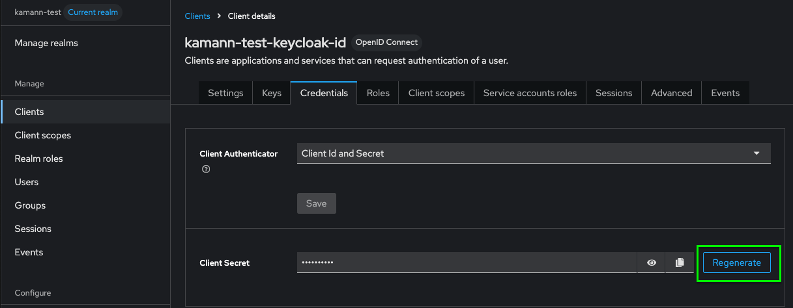
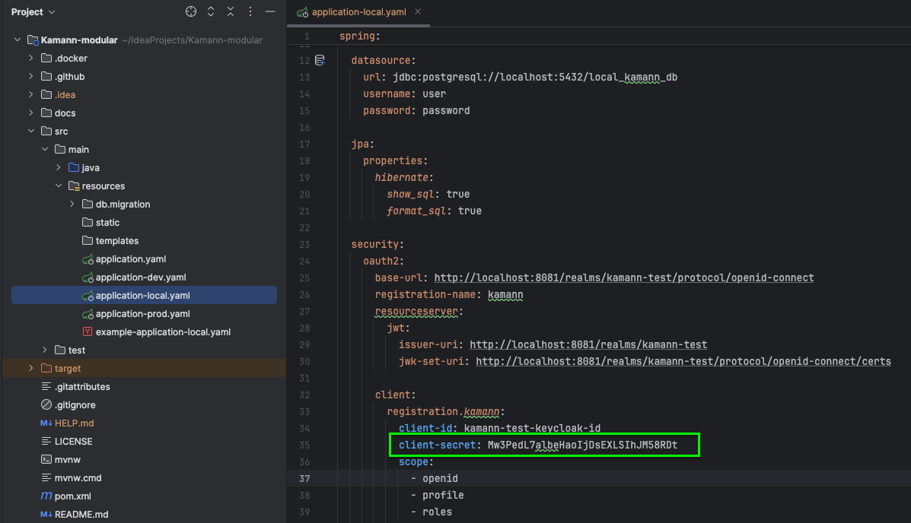

### 📘 This guide is also available in the [🇵🇱 Polish version](manual-client-secret-setup-pl.md)

## To run the application that communicates with a remote Keycloak instance, you need to obtain the current access credentials from the project owner and update the .env file located in the root directory of the project accordingly. Then, simply run the application in the dev environment.

# Manual Configuration of `client_secret` in Keycloak (since version 25) for local run purposes.

Starting with **Keycloak version 25**, the ability to automatically import the `client_secret` value during realm import has been **intentionally disabled**. This change affects confidential clients (OIDC), for which the secret must now be **manually set in the admin console** after import.

This guide provides step-by-step instructions on how to manually generate and configure the `client_secret` in the Keycloak admin interface. It is intended for developers and administrators who use automated deployments or scripts and now need to perform an additional manual step after importing a client.

## 🔰 First Startup of Keycloak

When starting the Keycloak instance for the first time using the current project configuration (as of **June 18, 2025**), the system initializes with a predefined realm configuration. This includes default clients, roles, and users; however — due to limitations introduced in Keycloak 25+ — **the `client_secret` value for confidential clients is not included**.

To start the Keycloak instance, run the `docker-compose-keycloak-local` script located in the `.docker/keycloak/` directory.

If you use IntelliJ IDEA, you can conveniently do this by clicking a single button from the “Services” panel or from the editor, as shown in the screenshot below:

📸 *Keycloak startup button in IntelliJ:*


To verify that Keycloak initialized successfully, open your browser and navigate to:

[http://localhost:8081](http://localhost:8081)

If everything works correctly, you should see the Keycloak admin console login screen.

📸 *Keycloak login form:*<br>


After starting the container:

1. The realm is imported using the `--import-realm` mechanism, configuring a locally running Keycloak instance.
2. Confidential clients will appear in the admin console, but the `client_secret` field will be **empty**.
3. You must manually enable client authentication and generate the secret through the graphical interface.

## 🔐 Manual Setting of `client_secret` in Keycloak

1. Log in to the Keycloak admin console with username: `admin` and password: `password`.
2. Select the appropriate realm (if not active yet). 
3. Go to the **Clients** section from the left menu.
4. Select the confidential client whose configuration you want to complete. 
5. Go to the **Credentials** tab. 
6. Generate a new credential by clicking **Regenerate secret**. 
7. Copy the `client_secret` value and use it in your application configuration.

## 🧩 Configuring the Application to Work with Local Keycloak

To enable the application to properly communicate with a locally running Keycloak instance, you need to configure the appropriate connection settings in the application.

In the current project state:
- The **`prod`** environment does not yet have the full infrastructure to operate.
- The **`dev`** environment requires additional setup and dependent services to be started.
- Therefore, the supported environment for running the application locally is **`local`**.

The `local` environment configuration can be customized individually — according to personal development environment preferences, e.g., different ports.

For convenience, the repository contains a sample configuration file **`example-application-local.yaml`** proposing a complete setup that you can copy entirely into your own `application-local.yaml` file to quickly launch the application locally.

### 🔑 Setting the `client_secret` in the Application Configuration

After generating the client secret (`client_secret`) in the Keycloak admin console (per the above instructions), update your local application configuration file to enable proper authorization.

Change the value of the property **`spring.security.oauth2.client.registration.kamann.client-secret`**: 

✅ These are all the required steps to enable the application to communicate correctly with the locally running Keycloak instance.

## ℹ️ Additional Information

- To facilitate running the application locally, the `application.yaml` file sets the default active profile:

  ```yaml
  spring:
    application:
      name: Reservation-system

    profiles:
      default: local

This means that — unless the runtime environment configuration (e.g., in IntelliJ IDEA) explicitly overrides the active profile (spring.profiles.active) — the application will start by default in the local profile.

⚠️ Note that some IDE configurations (especially previously saved Run/Debug configurations) may set their own environment profile values — sometimes unintentionally.
This can result in the application starting with a different profile, e.g., dev, even though the default is local.

✅ It is recommended to verify that the Active profile field in your IDE run configuration is either empty (if you want to use the default) or deliberately set if you want to force a different environment context.

## 🧪 Manual test

The project includes an automatic integration test that verifies the correctness of the entire authorization and Keycloak communication configuration.

However, if you want to manually verify that your local configuration has been correctly applied, after starting the application open your browser and go to:
http://localhost:8080/test

If the configuration is correct, you should see generated access_token tokens in the response — indicating that the application is correctly communicating with the Keycloak instance locally.
